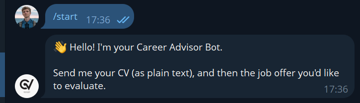
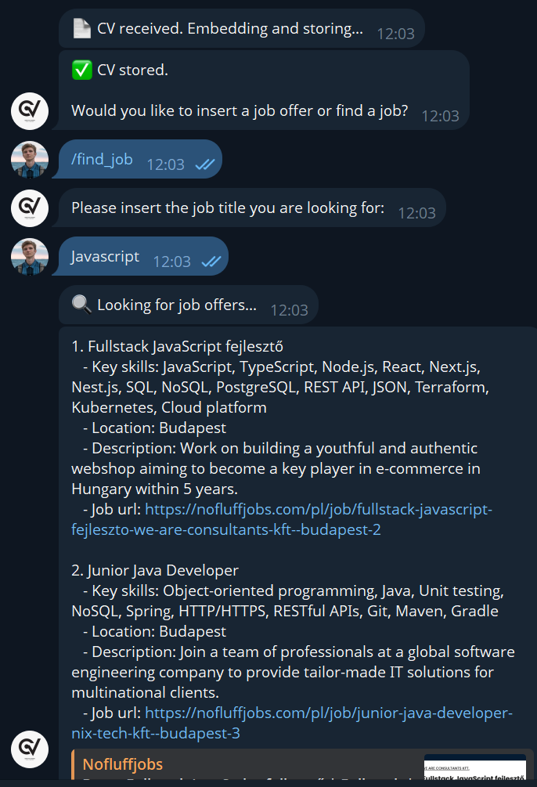
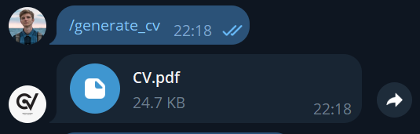

# 💼 CV Advisor

**CV Advisor** is an intelligent Telegram bot designed to help you elevate your job search and CV creation experience. Developed as part of the "TEG (Technologie Generatywne i AI)" course at PJATK Magistratura, this project leverages cutting-edge AI and generative technologies to provide personalized CV advice and job-matching features.

---

## 🚀 Features

- **Seamless Telegram Interface:** Chat with the bot to manage your CV and job search.
- **CV Upload:** Easily upload your existing CV for analysis.
- **Job Offer Finder:** Discover job offers tailored to your desired job title.
- **Custom Job Title Input:** Specify the job title you’re aiming for.
- **Smart CV Generation:** Instantly generate a Markdown or PDF CV tailored to your selected job offer.
- **AI-Powered Matching:** Uses Pinecone embeddings to match your CV with relevant job data scraped from various services.
- **LangSmith & LLM Integration:** Enhanced debugging and AI-driven improvements through LangSmith events and large language models.
- **CV Evaluation Module:** Automatically evaluates your CV and rewrites it if the score is low, ensuring top quality.

---

## 🛠️ Technologies Used

- **Python** (core language)
- **Telegram Bot API**
- **Pinecone** (vector embeddings)
- **LangSmith** (LLM event tracking)
- **OpenAI / LLMs** (text generation and analysis)
- **PDF & Markdown Generation Libraries**
- **Web Scraping Tools** (for job data)

---

## 📊 Workflow

1. **User:** Uploads CV via Telegram.
2. **Bot:** Analyzes CV, asks for desired job title.
3. **User:** Inputs job title.
4. **Bot:** Finds matching job offers, presents options.
5. **User:** Selects preferred offer.
6. **Bot:** Generates and sends a tailored CV in Markdown or PDF.
7. **Bot:** Evaluates CV quality and rewrites if needed.

---

## 🧑‍💻 Contributors

- **Anton Reut** — s24382  
- **Mateusz Sikora** — s24831  
- **Kasia Duk** — s34867  
- **Jarosław Fijałkowski** — s24461 

> _Empowering your career with AI-driven CV agent!_

---
# Screenshots
### Conversaction Start

### Finding job interactions

### Generating CV interactions
